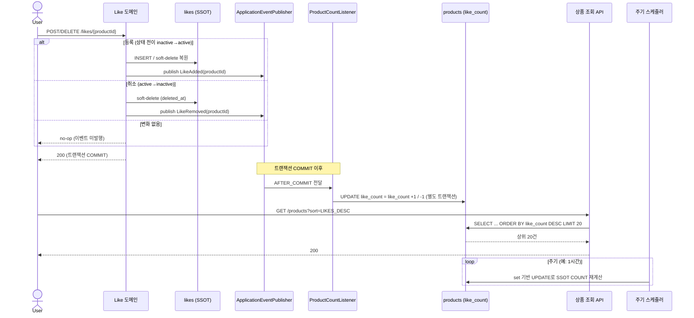

> **TL;DR**
> - 좋아요순 정렬은 `ORDER BY COUNT(likes)` 집계이기 때문에, 매 요청마다 좋아요 297만 건을 조인·집계·정렬합니다. 결과적으로 최대 7.3초가 걸렸습니다.
> - 인덱스로 풀스캔·해시조인은 개선해 14배 빨라졌지만(0.45초), 집계값 정렬(`Using temporary; filesort`)은 인덱스로 없애기 어렵습니다.
> - `like_count` 컬럼으로 반정규화해 집계 자체를 없애고 정렬 인덱스를 붙이면 SQL은 0.13ms, API는 33ms까지 줄었습니다. 대신 "어떻게 동기화·정합성을 유지하나"라는 새로운 문제가 생깁니다.

상품과 상품 좋아요는 테이블 정규화로 분리되어 있습니다. 상품 목록에 "좋아요 순" 정렬을 붙이고, 시드 데이터를 넣어 실제로 호출해봤습니다. 시드 데이터는 상품 10만, 좋아요 약 297만, 재고 10만 규모였습니다.

일반 목록 조회는 1초쯤 나왔는데, 좋아요 순으로 정렬하니 초기 측정에서 한 번 호출에 최대 **7.3초**가 걸렸습니다. 페이지네이션과 `LIMIT 20`이 있는데도 느린 이유는 실행 쿼리에서 드러났습니다.

## 좋아요 순 정렬이 만드는 쿼리

좋아요 수는 상품 테이블이 아니라 별도의 `likes` 테이블에 행으로 쌓입니다. 따라서 "좋아요 많은 순"으로 정렬하려면 상품마다 좋아요를 세야 합니다.

```sql
SELECT p.*
FROM products p
LEFT JOIN likes l ON l.product_id = p.id AND l.deleted_at IS NULL
WHERE p.status = 'ON_SALE' AND p.deleted_at IS NULL
GROUP BY p.id
ORDER BY COUNT(l.id) DESC, p.id DESC
LIMIT 20;
```

`EXPLAIN`을 확인하면 다음과 같습니다.

| 테이블 | type | key | rows | Extra |
|--------|------|-----|-----:|-------|
| p (products) | ALL | NULL | 99,583 | Using temporary; Using filesort |
| l (likes) | ALL | NULL | 2,954,528 | Using join buffer (hash join) |

1. `type=ALL` × 2, `key=NULL` — 두 테이블 다 인덱스 없이 풀스캔.
2. `Using temporary` — 98k 그룹을 임시 테이블에 집계.
3. `Using filesort` — 그 결과를 정렬. 인덱스로 정렬하지 못합니다. 정렬 기준이 `COUNT()` 집계값이기 때문입니다.
4. `hash join` + 297만 스캔 — 매번 좋아요 전체를 메모리 해시로 빌드.

여기서 핵심은 `LIMIT 20`이 정렬 비용을 줄여주지 못한다는 점입니다. 정렬 기준이 `COUNT(*)`라 상위 20개를 알려면 일단 전부 세서 줄을 세워봐야 합니다. 20개만 보고 멈출 방법이 없습니다. 결국 매 요청마다 297만 건을 조인하고 10만 개를 정렬하는 셈입니다.

### 커서 페이징의 장점도 사라지는 이유

참고로 이 정렬에는 커서(키셋) 페이징을 붙여도 기대하는 성능 이점이 거의 없습니다. 커서 페이징은 정렬 기준값이 테이블에 저장돼 있어서 인덱스로 찾아갈 수 있을 때 효과가 큽니다.

```sql
WHERE (price, id) > (:lastPrice, :lastId)
ORDER BY price, id
LIMIT 20
```

그런데 좋아요 순의 정렬 기준은 `COUNT(likes)`입니다. 상품 테이블에 없고, 매번 계산해야 하는 집계값입니다. SQL 실행 순서를 보면 이유가 분명합니다.

```text
1. FROM / JOIN      ← 테이블 결합
2. WHERE            ← 개별 row 필터 (집계 전)
3. GROUP BY         ← 그룹으로 묶음
4. 집계함수 계산       ← COUNT(*) ... 여기서 값이 생김
5. HAVING           ← 집계 결과로 필터
6. SELECT
7. ORDER BY
8. LIMIT / OFFSET
```

`COUNT(*)`는 3번에서 묶인 뒤 4번에서야 값이 생깁니다. 2번 `WHERE` 시점엔 존재하지 않으니 `WHERE 좋아요수 < :직전값`을 쓸 수 없고, `HAVING`으로 가야 합니다. 그런데 `HAVING`은 전체를 다 묶고 다 센 다음에 거릅니다. 커서의 장점은 "앞부분을 보지 않고 마지막 위치에서 이어 조회"하는 것인데, 매번 전부 집계하면 이점이 사라집니다. 이 한계는 반정규화로 정렬 기준값을 컬럼으로 만든 뒤에야 풀 수 있습니다.

## 1차 개선: 인덱스

쿼리가 어디를 풀스캔하는지는 `EXPLAIN`으로 확인했습니다. 이후 `WHERE / JOIN / GROUP BY / ORDER BY` 절을 보고 인덱스를 결정했습니다.

**`likes(product_id, deleted_at)`** — 조인과 좋아요 카운트가 `product_id`로 접근하는데 인덱스가 없었습니다. 기존 유니크 키는 `(user_id, product_id)` 순서라 `product_id` 단독 조회엔 사용할 수 없기 때문에, 쿼리가 `WHERE product_id=? AND deleted_at IS NULL`로 항상 두 컬럼을 같이 쓰니 복합키로 묶었습니다. 그러면 테이블을 읽지 않고 인덱스만으로 개수를 셀 수 있습니다(커버링 인덱스).

**`products(brand_id, status)`** — 브랜드 필터용입니다. `brand_id`는 `status`보다 카디널리티가 높으니 앞에 두고, `status`는 뒤에 두었습니다. 사실 `status`는 `ON_SALE`이 90% 이상이라 단독으로는 풀스캔이 더 싸지만, 항상 같이 쓰는 컬럼이라 뒤에 넣는 것은 비용이 거의 없는 선택입니다.

인덱스를 추가하고 `EXPLAIN`을 다시 확인했습니다. `likes` 쪽이 가장 크게 바뀌었습니다.

| likes 접근 | baseline | TO-BE |
|-----------|----------|-------|
| type | ALL (풀스캔) | ref (인덱스 조회) |
| key | NULL | idx_likes_product_deleted |
| rows | 2,954,528 | 29 |
| Extra | Using join buffer (hash join) | Using index (커버링) |

좋아요 297만 건 해시 조인이, 상품마다 커버링 인덱스로 **29행만** 들여다보는 조회로 바뀌었습니다. 브랜드 필터 쪽도 풀스캔(`type=ALL`)에서 인덱스 조회(`type=ref`)로 바뀌어, 전체를 훑지 않고 해당 브랜드의 상품만 바로 찾아갑니다.

쿼리는 5.8초에서 0.41초로, API는 6.2초에서 0.45초로 줄었습니다. 약 14배 개선됐습니다.

## 인덱스로는 더 못 줄이는 한계

인덱스 추가만으로 14배 개선은 분명 큰 수치입니다. 그런데 API 레이턴시 450ms는 실제 서비스에서 사용자 입장에선 여전히 오래 걸리는 시간입니다. 실행 계획을 다시 보면 남아있는 문제가 있었습니다.

```text
Extra: ... Using temporary; Using filesort
```

`Using temporary; Using filesort`가 인덱스를 추가한 뒤에도 그대로 남아 있었습니다. 인덱스가 조인과 조회는 빠르게 했지만, `ORDER BY COUNT(l.id)`라 여전히 전체를 집계해서 임시 테이블에 담고 정렬해야 하기 때문입니다. `Using filesort` 자체가 항상 나쁜 것은 아니지만, 지금은 정렬 대상 row가 많아서 문제가 됩니다.

| 시나리오 | baseline | 인덱스 후 | 남은 병목 |
|---------|---------:|----------:|----------|
| 필터 없음 | 15s | 1s | temporary + filesort (집계 정렬) |
| 브랜드 필터 | 1.4s | 170ms | temporary + filesort (집계 정렬) |

인덱스로 개선할 수 있었던 것은 풀스캔과 해시 조인이었고, 남은 병목은 집계 정렬이었습니다. 0.41초라는 한계도 결국 이 "전부 세서 정렬하기"의 비용이었습니다. 핵심 문제는 인덱스 부재보다, 매 요청마다 좋아요를 처음부터 다시 센다는 점에 있었습니다.

## 2차 개선: 반정규화

다음 방향은 매 요청마다 세지 않고 미리 세어두는 것이었습니다. 상품 테이블에 `like_count` 컬럼을 두면 `ORDER BY COUNT(like.id)` 없이 `like_count`만으로 정렬할 수 있습니다.

```sql
SELECT p.*
FROM products p
WHERE p.status = 'ON_SALE' AND p.deleted_at IS NULL
ORDER BY p.like_count DESC, p.id DESC
LIMIT 20;
```

조인도 없고 `GROUP BY`도 없습니다. 상품 컬럼 하나로 정렬할 수 있습니다.

### 반정규화 선택지: 컬럼 추가 vs 별도 집계 테이블

반정규화에는 두 가지 선택지가 있었습니다. 하나는 `products` 테이블에 `like_count` 컬럼을 추가하는 방식이고, 다른 하나는 `product_like_summary` 같은 별도 집계 테이블을 두는 방식입니다. 둘 다 denormalization이지만, 전자는 원본 엔티티에 파생 값을 붙이는 방식이고, 후자는 조회용 projection/read model을 분리하는 방식입니다.

읽기 성능 차이는 크지 않고, 차이는 운영 방식에 있습니다. 별도 집계 테이블은 CQRS 읽기 모델이 커질 때 유리합니다. 지금은 집계가 `like_count` 하나지만 `order_count`, `review_count`처럼 집계가 많아지면 별도 projection 테이블로 분리하는 편이 낫습니다. 이번엔 집계가 `like_count` 하나뿐이라 상품 테이블에 컬럼을 추가하는 방식을 선택했습니다.

다만 어떤 방식이든 핵심 문제는 **미리 집계한 like_count를 어떻게 동기화할 것인가**입니다. 동기·이벤트·배치 중 무엇으로 갱신하느냐가 쓰기 경합과 정합성을 좌우합니다.

### 동기화 전략

SSOT는 여전히 `likes` 테이블입니다. `like_count`는 거기서 파생된 캐시일 뿐입니다.

동기로 처리하면 좋아요 한 번에 두 테이블을 같이 갱신해야 합니다. 이벤트로 처리하면 `likes`만 갱신하고 카운트는 비동기로 맞춥니다. 이때 멱등성을 위해 `+1` 증분 대신 매번 재계산해서 `UPDATE` 하면 주기 배치도 필요 없겠지만, 인기상품의 경우 매 이벤트마다 재계산하는 비용이 큽니다.

최종 전략은 다음과 같습니다.

1. 좋아요 등록/취소 → `likes` INSERT/soft-delete (SSOT) + 도메인 이벤트 발행
2. `AFTER_COMMIT` 리스너 → 별도 트랜잭션으로 `products.like_count` +1 / -1 (O(1), 빠름)
3. 주기 스케줄러 → SSOT에서 set 기반 재계산으로 최종적 일관성 적용

`AFTER_COMMIT` 리스너는 원 트랜잭션이 커밋된 뒤 실행됩니다. 그래서 카운트 증분 `UPDATE`는 좋아요 등록/취소 트랜잭션에 끼워 넣지 않고, 별도 트랜잭션으로 처리합니다. 읽기 성능을 위해 `like_count`를 빠르게 갱신합니다.

증분 업데이트는 빠르지만 이벤트가 유실되면 값이 어긋날 수 있습니다. 그래서 스케줄러가 `likes`에서 다시 계산하는 작업을 하고, 스케줄러에서 호출한 쿼리는 상품별로 하나씩 `COUNT()`를 호출하지 않고, `likes`를 `product_id` 단위로 한 번 집계한 뒤 `products`에 set 기반으로 반영합니다.

```java
@Modifying(clearAutomatically = true)
@Query(value = """
    UPDATE products p
    LEFT JOIN (
        SELECT product_id, COUNT(*) AS cnt
        FROM likes
        WHERE deleted_at IS NULL
        GROUP BY product_id
    ) t ON p.id = t.product_id
    SET p.like_count = COALESCE(t.cnt, 0)
    """, nativeQuery = true)
int reconcileLikeCounts();
```

좋아요가 하나도 없는 상품은 `LEFT JOIN` 결과가 `NULL`이 되므로 `COALESCE(t.cnt, 0)`으로 0을 넣습니다. 이 쿼리는 요청 경로가 아니라 스케줄러에서만 실행되므로, 사용자 목록 조회의 응답 시간에는 영향을 주지 않습니다.

단, 스프링 이벤트는 애플리케이션 장애 시 유실될 수 있습니다. 저는 주기적 배치로 최종 정합성을 보장했고, 더 강한 보장이 필요할 때는 outbox나 메시지 큐를 붙이는 편이 적합할 것 같습니다. 데이터가 더 커지면 전체 보정 대신 변경된 상품 ID만 모아 부분 업데이트 하거나, `product_id` 범위 단위로 나눠 실행하는 방식으로 확장할 수 있습니다.



### 반정규화 후 측정

반정규화 후 실행 계획에서는 집계와 조인이 통째로 사라졌습니다. `likes` 테이블이 쿼리에서 빠졌습니다.

| 테이블 | type | key | rows | Extra |
|--------|------|-----|-----:|-------|
| p (products) | ALL | NULL | 98k | Using where; Using filesort |
| l (likes) | - | - | - | 쿼리에서 제거됨 |

`Using temporary`와 `likes` 조인은 사라졌지만, 아직 상품 9만 8천 개를 `like_count`로 정렬하는 `filesort`는 남아 있었습니다.

그래서 마지막으로 정렬 인덱스를 추가했습니다. MySQL 8.0 기준으로 `DESC` 정렬 인덱스를 사용했습니다.

```sql
CREATE INDEX idx_products_status_deleted_like
ON products (status, deleted_at, like_count DESC, id DESC);
```

브랜드 필터가 자주 붙는 조회에는 별도 인덱스를 둡니다.

```sql
CREATE INDEX idx_products_brand_status_deleted_like
ON products (brand_id, status, deleted_at, like_count DESC, id DESC);
```

| 테이블 | type | key | rows | Extra |
|--------|------|-----|-----:|-------|
| p (products) | index | idx_products_status_deleted_like | 20 | Using where |

`filesort`가 사라졌고, 9만 8천 개를 전부 정렬하지 않고 인덱스 순서대로 읽다가 `LIMIT 20`에서 멈춥니다.

## 단계별로 정리하면

| 단계 | 실행 계획 핵심 | SQL | API |
|------|----------------|----:|----:|
| `ORDER BY COUNT(likes)` | 해시 조인 297만 + temporary + filesort | 5.8s | 6.2s |
| 인덱스만 | 커버링 인덱스 조회, temporary/filesort 잔존 | 0.41s | 0.45s |
| 반정규화 (정렬 인덱스 없음) | filesort만 (집계·조인 소멸) | 33ms | 72ms |
| 반정규화 + 정렬 인덱스 | filesort 제거, 상위 20개만 읽음 | 0.13ms | 33ms |

`ORDER BY COUNT(like)` → 인덱스 → 반정규화 → 반정규화 + 인덱스. 흐름을 정리하면 다음과 같습니다.

- **인덱스**는 풀스캔과 조인을 해결할 수 있지만, `ORDER BY COUNT()`처럼 집계값으로 정렬하는 한 "전부 집계하여 정렬하기"는 인덱스로는 개선하기 힘듭니다.
- **반정규화**는 `COUNT()` 집계 자체를 미리 해두는 선택입니다. 집계를 컬럼 하나로 바꾸면 정렬 인덱스가 비로소 제 역할을 하고 `LIMIT`가 살아납니다.

다만 반정규화는 "어떻게 정합성을 유지할 것인가"라는 또 다른 문제를 가져옵니다.
