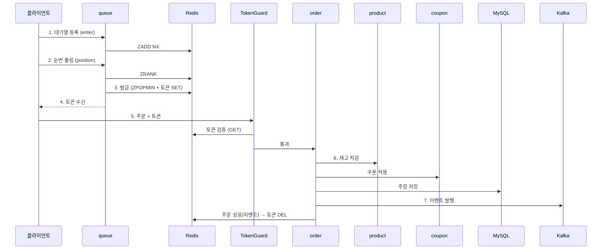

> **TL;DR**
> 이커머스에서 한 상품에 주문이 몰리는 상황을 가정하고, order API 가 감당할 수 있는 임계치만큼만 진입시키는 대기열을 구현했습니다.
> 로컬 컨테이너 환경이라 트래픽을 정밀하게 제어하진 못했지만, DB connection pool → order API tps → 입장 속도 순으로 근거 기반으로 수치를 정하고 테스트했습니다.
## 대기열 방식

대기열을 구성하는 아키텍처는 여러 가지가 있는데, 이번엔 redis 를 사용해서 구현을 진행하였습니다. 

흔히 대기열을 얘기할 때 **은행 창구 방식**과 **놀이공원 방식**으로 나눕니다.

**은행 창구 방식**은 안에 있는 인원을 N명으로 고정하는 방식(concurrency 제어)입니다. 한 명이 나가면 한 명을 들여보냅니다. 동시 처리량을 정확히 묶어둘 수 있어 서버 부하를 안전하게 제어할 수 있지만, 문제는 stateless HTTP에서 요청이 끝난 뒤 사용자가 주문을 포기했는지를 서버가 알기 어렵다는 점입니다. 결국 TTL이 만료돼 슬롯이 비어야만 다음 사람을 들여보낼 수 있어서, 이탈한 유저의 자리가 TTL 동안 묶여 대기 시간이 길어집니다.

그렇다고 은행 창구 방식이 나쁜 건 아닙니다. **이탈을 확실히 감지할 수 있는 환경**이라면 오히려 이쪽이 맞습니다. WebSocket/SSE 처럼 연결 단절 신호를 받을 수 있거나 heartbeat로 이탈을 판단할 수 있는 환경, 좌석·라이선스처럼 **"동시 N개" 자체가 자원**인 경우(제약이 rate 가 아니라 concurrency)에는 은행 창구 방식을 사용할 수 있습니다.

**놀이공원 방식**은 안에 몇 명이 있든 신경 쓰지 않고 **주기적으로 N명씩 흘려보내는 방식**(rate 제어)입니다. 나가는 사용자를 추적할 필요가 없어 stateless HTTP 환경에서 입장률을 제어하기에 적합했습니다. 대신 이 "주기당 N명"(= 입장 속도)을 서버가 감당하는 선에서 정해야 하므로, **뒷단이 얼마나 버티는지 측정과 분석이 필요**합니다.

이번 주문 API 는 stateless HTTP 요청/응답이고 제약이 "초당 처리량"이라, 최종적으로 놀이공원 방식을 선택했습니다. 그래서 이 글의 나머지는 "얼마나 흘려보내도 되는가"를 측정하는 과정입니다.

## 구조




클라이언트는 대기열에 등록(enter)하고 순번을 폴링하다가, 스케줄러가 발급한 입장 토큰을 받으면 주문합니다. 주문 요청은 order API 앞의 TokenGuard 가 토큰을 검증한 뒤 통과시키고, 주문 이후(이벤트 → Kafka)는 파이프라인을 탑니다.

큐가 부하를 잘 받아내려면 결국 뒷단인 주문 API 가 얼마나 버티는지부터 알아야 합니다. 그래서 아래 순서로 튜닝했습니다.

1. **DB 커넥션 풀** — 한정된 리소스에서 풀을 몇으로 잡아야 하나?
2. **주문 API 한계 TPS** — 그 풀에서 초당 몇 건까지 버티나?
3. **입장 속도(batch-size)** — 그 한계를 넘지 않으려면 얼마나 흘려보내야 하나?

### DB connection pool
로컬 Docker 컨테이너 환경에서 측정했습니다. `constant-arrival-rate`로 주문 API에 50/70/90/110 requests/s를 각각 유입하고, 각 구간은 웜업 후 측정했습니다. 이 수치는 절대 성능이 아니라 이 환경에서 입장률을 정하기 위한 상대 기준으로 해석했습니다. HikariCP connection pool은 [About Pool Sizing](https://github.com/brettwooldridge/HikariCP/wiki/About-Pool-Sizing)을 참고해 4 → 8 → 12로 변경하며 비교했습니다.

유입 50/s 를 기준으로 pool 별 결과입니다.

| pool | 달성     | 성공률  | p95   | timeout |
| ---- | ------ | ---- | ----- | ------- |
| 4    | 49.2/s | 100% | 1.15s | 0       |
| 8    | 50.0/s | 100% | 312ms | 0       |
| 12   | 50.0/s | 100% | 527ms | 0       |

pool 8은 p95가 312ms로 가장 낮았고, 12로 더 키워도 개선되지 않아 이후 측정은 pool 8로 고정했습니다.

### tps 측정
Order API 프로세스 (실제 코드 순서)
1. 주문번호 발행 (Facade 에서 채번 후 주문 생성 호출)
2. 유저 확인 (없으면 재고 건드리기 전에 종료)
3. 오더라인 처리 — productId 오름차순 (재고 락 순서를 고정해 동시 주문 deadlock 방지)
	ㄴ 상품 정보 조회 
	ㄴ 재고 차감
	ㄴ 브랜드 정보 조회
4. 쿠폰 적용 (있으면 할인 계산해 주문에 반영)
5. PENDING 주문 + 주문항목 저장
6. 데이터 플랫폼 이벤트 발행
7. 유저 활동 로그 이벤트 발행

| 유입    | 달성     | 성공률   | p95   | timeout |
| ----- | ------ | ----- | ----- | ------- |
| 50/s  | 50.0/s | 100%  | 86ms  | 0       |
| 70/s  | 65.5/s | 99.3% | 2.42s | 9       |
| 90/s  | 76.9/s | 81%   | 4.1s  | 293     |
| 110/s | 89.5/s | 76.9% | 5.3s  | 408     |

50/s 까지는 p95 86ms · 성공률 100% · 타임아웃 0 으로 안정적인데, 70/s 로 올리는 순간 p95 가 2.42s 로 튑니다. 처리량은 40% 늘었지만 지연은 약 28배 나빠진 셈이고, 90/s 부터는 성공률까지 무너집니다.

70/s 도 성공률만 보면 99.3% 라 "버틴다"고 할 수도 있습니다. 하지만 p95 2.42s 는 사용자 입장에선 이미 느린 응답입니다. 그래서 주문 API 의 최대 처리량이 아니라, 이 환경에서 지연이 낮고 에러가 없었던 **안전 입장 속도 50/s** 를 기준으로 잡았습니다.

### 입장 프로세스

> 측정한 50/s 안에서 사용자를 어떻게 흘려보내는지는 스케줄러가 맡고, 아래 두 값으로 제어합니다.

```yml
order-queue:  
  admission:  
    interval-ms: 200  
    batch-size: 10
```

```java
// 이전 tick 이 끝난 뒤 interval-ms 만큼 기다렸다가 다음 tick()
@Scheduled(fixedDelayString = "${order-queue.admission.interval-ms}")
public void tick() {
    // 인스턴스가 여러 대여도 락을 잡은 한 대만 발급 (분산락)
    if (admissionLock.tryAcquire(Duration.ofMillis(admissionProperties.intervalMs()))) {
        queueService.admit();
    }
}

// 대기열(ZSET) 맨 앞에서 batch-size 만큼 꺼내(ZPOPMIN) 그만큼 입장 토큰을 발급한다.
public int admit() {
    List<String> admitted = waitingQueueRepository.popFront(admissionProperties.batchSize());
    admitted.forEach(userId -> entryTokenStore.issue(userId, entryTokenProperties.ttl()));
    return admitted.size();
}
```

`interval-ms` 는 이전 발급 작업이 끝난 뒤 다음 tick 까지 기다리는 시간이고, `batch-size` 는 한 tick 에 꺼내는 인원입니다. 따라서 이 설정의 목표 입장 속도는 50/s이며, 실제 발급률은 발급 작업 시간까지 포함해 측정해야 합니다. 입장 속도(`batch-size × 1000 / interval-ms`)는 폴링 시 클라이언트에게 보여주는 예상 대기시간(순번 ÷ 입장 속도) 계산에도 같은 값을 사용했습니다.


> 데모 프론트의 순번 폴링 — `position` 응답이 순번(740)·예상 대기(13초)·다음 폴링 간격(3000ms)을 내려줍니다.

대기열은 몰려드는 요청을 큐에 쌓아두고 주문 API 가 받을 수 있는 만큼만 스케줄러가 꺼내 보냅니다. 그래서 입장 속도가 주문 API 한계보다 높으면 안 됩니다. 더 빨리 입장시켜봐야 주문 API 앞에 다시 줄이 생겨서 대기열 큐를 둔 이유가 사라집니다.

그러면 batch 를 정하는 건 곧 입장 속도를 이 50/s 한계에 맞추는 문제가 됩니다.

테스트 시나리오는 입장한 사람의 70%만 주문하고, 나머지 30%는 토큰만 발급 받고 실제 주문을 하지 않는 사용자로 진행했습니다. 최악의 경우(전원 주문)엔 주문 속도 = 입장 속도가 될 수 있습니다. 그래서 입장 속도를 50/s 근처로 맞추는 걸 기준으로 삼되, batch 별 테스트를 통해 확인했습니다.

| batch | 입장 속도 | 전원 주문 시       | 판정               |
| ----- | ----- | ------------- | ---------------- |
| 8     | 40/s  | 40/s          | 안전하지만 입장 대기만 길어짐 |
| 10    | 50/s  | 50/s = 한계와 일치 | 전원 주문해도 안 넘는 최대치 |
| 12    | 60/s  | 60/s > 50/s   | 한계 초과            |

안전 입장 속도 50/s를 목표로 하면 batch 10이 후보입니다. 200ms 주기는 목표 입장 인원을 다섯 번으로 나눠 발급하기 위해 정했고, 실제 목표치를 조절하는 값은 batch-size입니다. 이후 8·10·12가 대기열 흐름에서 만드는 차이는 아래 테스트로 확인했습니다.

### 입장시 jitter를 사용하지 않은 이유
```java
public static Duration pollInterval(long rank) {  
    if (rank < 100) {  
        return Duration.ofSeconds(1);  
    }  
    if (rank < 1000) {  
        return Duration.ofSeconds(3);  
    }  
    return Duration.ofSeconds(5);  
}
```
스케줄러가 200ms 마다 batch 명에게 동시에 토큰을 발급하면 그 batch 가 한꺼번에 주문을 쏴 순간적으로 부하가 몰리는 thundering herd 가 생길 수 있어, 토큰 발급에 jitter 를 줘서 이를 방지하는 방법을 고려할 수 있습니다. 이 구현에서는 폴링 주기와 진입 시각의 차이가 주문 도착을 어느 정도 분산합니다. 다만 이는 보장이 아니므로, batch 10에서 p95와 timeout을 확인한 뒤 별도 jitter는 두지 않았습니다.

## 테스트
batch 8/10/12 를 각각 돌려 주문 API 가 얼마나 안정적인지 비교했습니다. (토큰 대기 = 진입부터 입장 토큰을 받기까지 걸린 시간, p95)

### 시나리오 1 — 70% 주문 / 30% 미주문(토큰만 보유)
> 1000명이 6초에 걸쳐 진입 · pool 8 · 웜업 후 측정

| batch | 입장 속도 | 성공률  | order p95 | 토큰 대기 | timeout |
| ----- | ----- | ---- | --------- | ----- | ------- |
| 8     | 40/s  | 100% | 215ms     | 19.1s | 0       |
| 10    | 50/s  | 100% | 195ms     | 14.0s | 0       |
| 12    | 60/s  | 100% | 205ms     | 11.0s | 0       |

수치로 보면 셋 다 주문 API 자체는 안정적이고(성공률 100%·타임아웃 0), p95 도 200ms 안팎으로 큰 차이가 없습니다. 다만 더 많은 인원을 활성화시킬수록(batch 가 클수록) 유저 대기 시간이 줄어듭니다(19 → 14 → 11초). 이 표만 보면 12 가 좋아 보이지만, 이건 30% 가 주문을 안 하는 가정 위의 값입니다.


> 같은 구간의 애플리케이션 지표 — 커넥션 풀 대기 0, CPU 약 13%, 에러 0.

### 시나리오 2 — 100% 전원 주문
그래서 30% 가정을 없애고, 입장한 전원이 주문하는 최악의 경우로 다시 측정했습니다.

| batch | 입장 속도 | 성공률  | order p95 | timeout |
| ----- | ----- | ---- | --------- | ------- |
| 8     | 40/s  | 100% | 156ms     | 0       |
| 10    | 50/s  | 100% | 220ms     | 0       |
| 12    | 60/s  | 100% | 441ms     | 0       |

100% 인원이 모두 주문해도 세 batch 모두 성공률 100%와 timeout 0을 기록했습니다. 다만 p95 레이턴시는 batch가 클수록 올라갔고, 10에서 12로 가면 약 2배가 됐습니다. 그래서 p95가 더 낮은 batch-size 10으로 결정했습니다.
